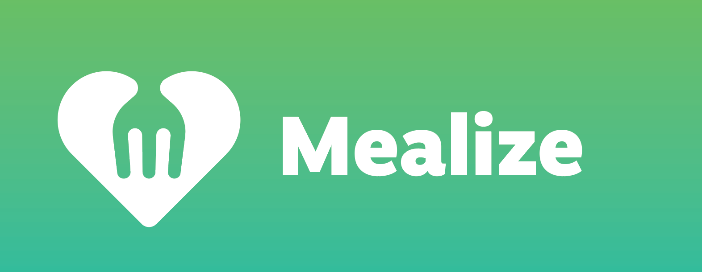

#     &nbsp;

## Link to Live Site

[Mealize Live Site](https://mealize.herokuapp.com/)

<br>

## Description

Mealize is a React and Flask app that aims to reduce food scarcity and waste by connecting businesses to nonprofits.
<br>

## Getting Started

1. Clone this repository

   ```bash
   git clone git@github.com:Luke-Yamasaki/Mealize.git
   ```

2. Install dependencies

      ```bash
      pipenv install --dev -r dev-requirements.txt && pipenv install -r requirements.txt
      ```

3. Create a **.env** file based on the .env.example file with credentials of your choice. I recommend creating a UUID for secrets.
If you do not know how to do so, here are the commands in JavaScript:

    const crypto = require('crypto')

    console.log(crypto.randomUUID({disableEntropyCache : true}));

    The images you see in the homepage were seeded from my S3 bucket. However, you will need to create your own AWS account, create a bucket and acquire credentials if you want to allow users to upload local files. There is a storage limit that builds up fast, so please be careful of data usage.

    If you are unfamiliar with AWS, here is an excellent walkthrough courtesy of James Robertson:
[AWS walkthrough](https://github.com/jamesurobertson/aws-s3-pern-demo#create-your-aws-user-and-bucket).
<br></br>

4. Create a PostgreSQL user, password and database to match your chosen credentials in the .env file.

    If you forgot commands, type 'psql' in your terminal to open up the PostgreSQL interface.

    Next, enter CREATE USER (your chosen username) WITH PASSWORD 'your password.' CREATEDB login;

    Then, type CREATE DATABASE (your chosen database name) WITH OWNER (the username from above);
<br></br>
    ## Do not forget to wrap your password in quotes and ignore any parentheses you see in my examples. Also, don't forget to add semi-colons at the end of each line and you are good to go!
<br></br>
5. Enter your shell environment, upgrade and seed your database, and run your flask app

   ```bash
   pipenv shell
   ```

   ```bash
   flask db upgrade
   ```

   ```bash
   flask seed all
   ```

   ```bash
   flask run
   ```

6. To run the React App, go inside the `react-app` directory, `npm install` and `npm start`. This should open your browser automatically but if not, you may navigate to `localhost:3000` to access the application.

<br>
<br>

## Technologies

<br>
<p float="left">
  
  &nbsp;
  
  &nbsp;
  
  &nbsp;
  
  &nbsp;
  
  &nbsp;
  
  &nbsp;
  
  &nbsp;
  
  &nbsp;
  
  &nbsp;
  
  &nbsp;
  
  &nbsp;
  
  &nbsp;
</p>

<br>
